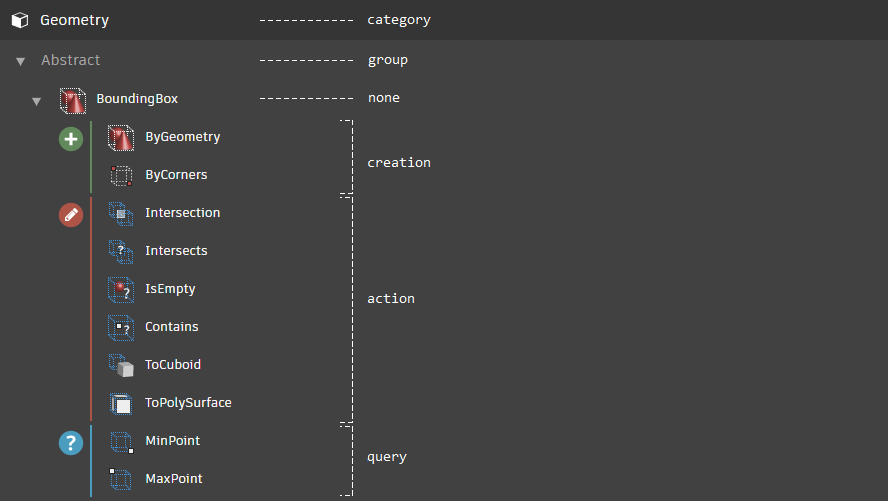

# Layout Specifications
The layout specification is a `json` document that describes the layout of the library view. It outlines the hierarchical structure (i.e. tree structure) of the library view, as well as defines items that should go under each tree node.

### The simplest form of element
The following example illustrates the simplest form of a specification `json` document -- it is made up of a single *element* (the layout specification document is a hierarchical tree of *elements*). The `elements` entry represents a list of root elements that should be displayed at the root level of the library view. For this example, the library view contains only a single root node with `Display` as its text:

```json
{
  "elements": [
    {
      "text": "Display",
      "iconName": "Category.Display.svg",
      "elementType": "category",
      "include": [],
      "childElements": []
    }]
}
```

This results in library view that looks like the following image:


#### Element information
Each element in the hierarchical structure contains the following key-value pairs:

- `text` - the content to display on the corresponding library item
- `iconName` - file name of the icon for the corresponding library item
- `elementType` - the type of the element. Possible values are *category*, *group*, *creation*, *action*, *query* and *none*. See the following section for detailed descriptions of each element types
- `include` - data types that should be included under this given library item (more details on this later)
- `childElements` - nested elements under this element (its usage will become clearer below)

#### Element types

- `category` - Category elements represent the root library items on the library view
- `group` - Groups comes directly under its parent category, it contains just text without icon
- `creation` - Elements of this type result in library items that get clubbed under the *Create* cluster
- `action` - Elements of this type result in library items that get clubbed under the *Action* cluster
- `query` - Elements of this type result in library items that get clubbed under the *Query* cluster
- `none` - All other expandable library items that are not categories or groups



### Adding items to an element
Data types can be added to a given element by adding them as values to `include` key, as illustrated in the example below. In this case, both `DSCore.Color` and `DSCore.ColorRange2D` classes will be added under `Display` library item.

```json
{
  "elements": [
    {
      "text": "Display",
      "iconName": "Category.Display.svg",
      "elementType": "category",
      "include": [
        { "path": "DSCore.Color" },
        { "path": "DSCore.ColorRange2D" }
      ],
      "childElements": []
    }]
}
```

This results in library view that looks like the following image:


### Adding nested elements
Adding on to the previous example, a nested element with text `Watch` is added under `Display` element. Just like the parent element, nested elements contain keys like `text`, `iconName`, etc. Note that however, the nested element does not have to contain `childElements` if it does not need to:

```json
{
  "elements": [
    {
      "text": "Display",
      "iconName": "Category.Display.svg",
      "elementType": "category",
      "include": [
        { "path": "DSCore.Color" },
        { "path": "DSCore.ColorRange2D" }
      ],
      "childElements": [
        {
          "text": "Watch",
          "iconName": "Watch",
          "elementType": "none",
          "include": []
        }        
      ]
    }]
}
```

This results in library view that looks like the following image:


### Adding items to a nested element
The following example adds three new data types under `Watch` element:

```json
{
  "elements": [
    {
      "text": "Display",
      "iconName": "Category.Display.svg",
      "elementType": "category",
      "include": [
        { "path": "DSCore.Color" },
        { "path": "DSCore.ColorRange2D" }
      ],
      "childElements": [
        {
          "text": "Watch",
          "iconName": "Watch",
          "elementType": "none",
          "include": [
            { "path": "Core.View.Watch" },
            { "path": "Core.View.Watch Image" },
            { "path": "Core.View.Watch 3D" }            
          ]
        }        
      ]
    }]
}
```

This results in library view that looks like the following image:


